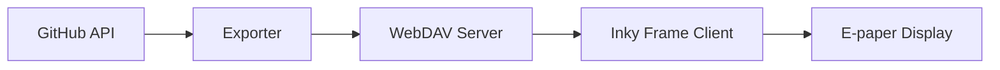

# inky-frame

A personal dashboard for the Pimoroni Inky Frame e-paper display that shows GitHub project issues and calendar events. The system fetches data from GitHub, processes it through a WebDAV server, and displays it beautifully on the e-paper screen.



## Developing

1.  Install Thonny: `bash <(wget -O - https://thonny.org/installer-for-linux)`

1.  Connect the Inky Frame to the laptop using USB.

1.  Launch Thonny.

1.  Press **Stop** in Thonny to stop the Inky Frame from running its provided program.

1.  Modify files on the Inky Frame using the _Raspberry Pi Pico_ window in Thonny.

1.  When you've changed a file, select `main.py` and press the **Run** button to start Inky Frame from scratch.


### Developing with aider

```
echo 'anthropic-api-key: KEY' > ~/.aider.conf.yml

aider client/work.py
```


### Weird things

- Sometimes Thonny doesn't recognise the Inky Frame at all. Try unplugging, plugging back in again, and then pressing the Stop/Reset button in Thonny.


