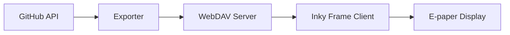

# inky-frame

This is the code for a personal dashboard on Pimoroni's Inky Frame e-paper display, which shows:

- your GitHub issues in a particular Project
- today's calendar events
- the temperature outside (coming soon)

It consists of:

- the Exporter: a Python program that runs on your laptop, which fetches data from GitHub, formats it, and uploads it to a WebDAV server (I use [Fastmail][1]). This is designed to run as a cron job.

- the Client: code that runs on the Inky Frame which downloads the data from WebDAV, and displays it beautifully on the e-paper screen. 

Now you've no excuse not to know what's happening today. :)



## Developing

1.  Install Thonny: `bash <(wget -O - https://thonny.org/installer-for-linux)`

1.  Connect the Inky Frame to the laptop using USB.

1.  Launch Thonny.

1.  Press **Stop** in Thonny to stop the Inky Frame from running its provided program.

1.  Modify files on the Inky Frame using the _Raspberry Pi Pico_ window in Thonny.

1.  When you've changed a file, select `main.py` and press the **Run** button to start Inky Frame from scratch.


### Setting up the Exporter

The exporter runs on your 

1. Create and activate a virtual environment:
```
python -m venv venv
source venv/bin/activate
```

2. Set up environment variables:
```
source .env
```

3. Install dependencies and run:
```
pip install -r requirements.txt
python app.py
```

### Developing with aider

```
echo 'anthropic-api-key: KEY' > ~/.aider.conf.yml

aider client/work.py
```

### Weird things

- Sometimes Thonny doesn't recognise the Inky Frame at all. Try unplugging, plugging back in again, and then pressing the Stop/Reset button in Thonny.


[1]: https://fastmail.com
